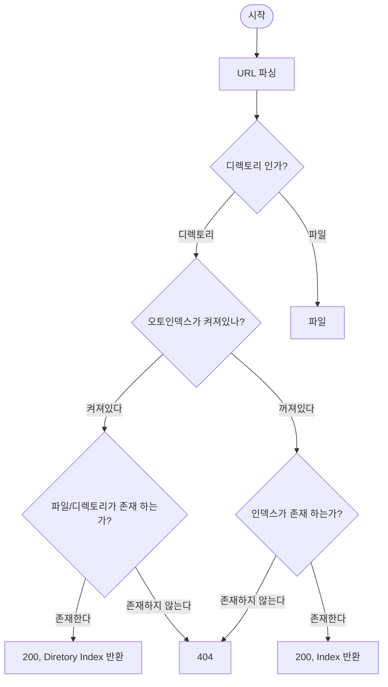

```mermaid
flowchart TD
    A([시작]) --> B[URL 파싱]
    B --> C{디렉토리 인가?}
    C --> |디렉토리| D{오토인덱스가 켜져있나?}
    C --> |파일| E[파일]
    D --> |켜져있다| F{파일/디렉토리가 존재 하는가?}
    D --> |꺼져있다| H{인덱스가 존재 하는가?}
    F --> |존재한다| G[200, Diretory Index 반환]
    F --> |존재하지 않는다| 404
    H --> |존재한다| I[200, Index 반환]
    H --> |존재하지 않는다| 404
    %% C -->|Two| E[iPhone]
    %% C -->|Three| F[fa:fa-car Car]
```
